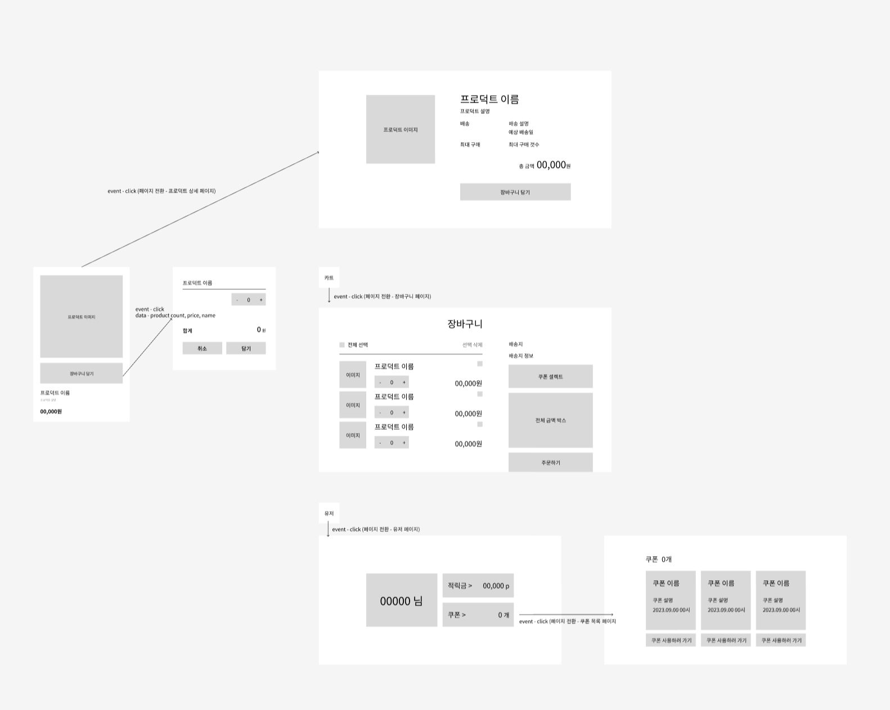
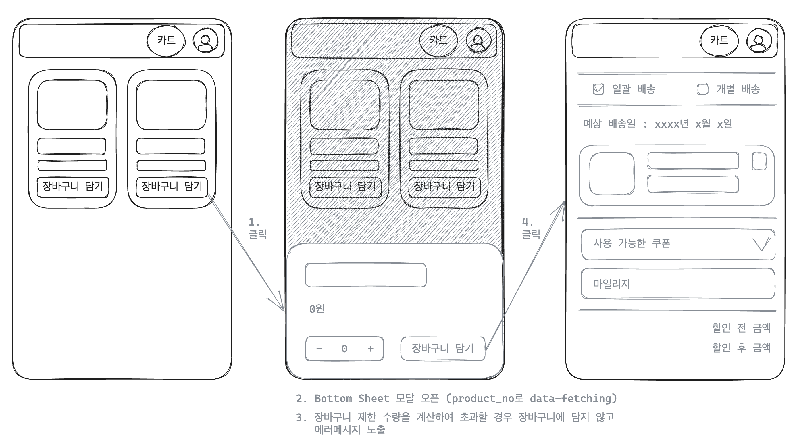
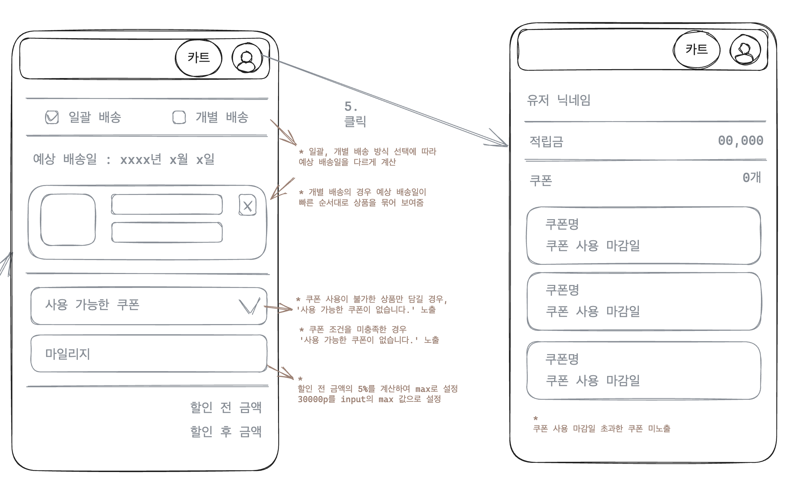
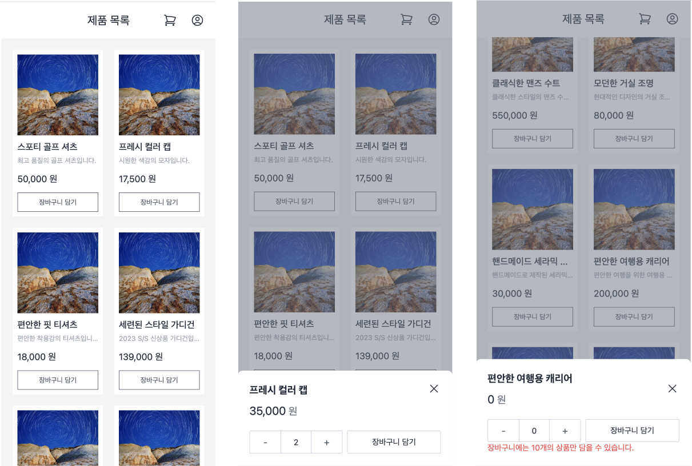
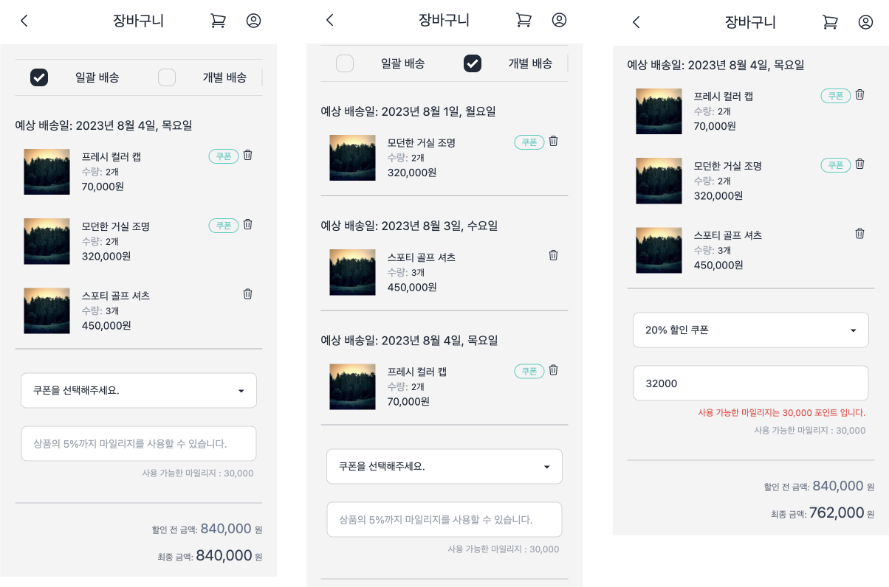

### 프로젝트 목표

- 상품, 장바구니, 프로필이 있는 간단한 E-Commerce 서비스 구현
- 제한된 조건(장바구니 수량 제한, 쿠폰/마일리지 조건에 따른 할인율 변경 등)에 맞는 로직 설계

### 프로젝트 작동

```shell
// json-server 구동 (8080)
yarn start:server

// client 구동 (3000)
yarn start
```

### 프로젝트 구현 스택

`TypeScript`, `React`, `TailwindCSS`, `SWR`, `react-hook-form`, `json-server`

<br />

### 프로젝트 구현 사항

메인페이지

- 상품 카드 리스트
- 상품 카드별 상품 데이터 반영
- 상품 카드 클릭시 상품 상세 페이지 이동
- 장바구니 담기 버튼 클릭시 Bottom Sheet 모달에서 수량 선택 후 담기

상품 상세 페이지

- 상품 데이터 노출
- 장바구니 담기 버튼 클릭시 Bottom Sheet 모달에서 수량 선택 후 담기

프로필 페이지

- 유저 데이터 노출
- 적립금, 사용 가능한 쿠폰 노출

장바구니 페이지

- 장바구니에 담긴 상품 데이터를 상품 카드로 노출
- 배송 방식 선택 (일괄 배송, 개별 배송) 후 방식에 맞게 상품 카드 노출
- 사용 가능한 쿠폰 Select Box
- 사용 가능한 마일리지 Input Box
- 할인 전 금액, 쿠폰/마일리지 반영 후 최종 금액

<br />

### 프로젝트 시나리오



> Figma Draft

<br />



1. 메인 페이지에서 각 상품 카드의 `장바구니 담기` 버튼 클릭 → Bottom Sheet UI 형태의 장바구니 담기 모달 오픈
2. 모달에서 현재 장바구니에 담긴 상품 수량을 계산하여 초과하여 담을 경우 에러 노출
3. 모달에서 장바구니 담기 버튼 클릭 → 장바구니에 최대 10개까지 담김



1. 장바구니의 배송 방식 선택 체크박스를 통해 일괄 또는 개별 배송을 선택할 수 있음
2. 선택한 배송 방식에 따라 아래 카트 상품 카드 UI의 변경이 있음
3. 쿠폰 사용이 불가한 상품만 장바구니에 있을 경우 쿠폰 셀렉트에 목록이 조회되지 않고, ‘사용 가능한 쿠폰이 없습니다.’ 노출
4. 마일리지의 경우 쿠폰 여부에 상관없이 최종 할인 전 금액의 5%를 계산하고 30,000 포인트와 비교하여 할인 금액 산정
5. 유저 아이콘 클릭으로 마이페이지 이동
6. 마이페이지에서는 유저 데이터를 확인 가능

<br />

### 프로젝트 구현



- 장바구니에 담긴 상품 갯수를 비교해서 장바구니에 담는 로직은 BottomSheetMenu 컴포넌트에서 계산했음

  ```tsx
  const addToCart = async () => {
    const { data: cartData } = await axios.get<CartDataType[]>(
      "http://localhost:8080/cart"
    );

    if (cartData) {
      const cartQuantity = cartData
        .map((el) => el.product_quantity)
        .reduce((acc, cv) => acc + cv, 0);
      const totalQuantity = cartQuantity + quantity;
      if (totalQuantity > 10) {
        setQuantityError(true);
        setQuantity(10 - totalQuantity < 0 ? 0 : 10 - totalQuantity);
      } else {
        if (productData && quantity !== 0) {
          const {
            product_no,
            product_name,
            prev_delivery_times,
            available_coupon,
            price,
          } = productData[0];
          const deliveryTimes =
            prev_delivery_times.length !== 0 &&
            Math.ceil(
              prev_delivery_times.reduce((acc, cv) => acc + cv) /
                prev_delivery_times.length
            );
          await axios.post(`http://localhost:8080/cart`, {
            product_no,
            product_name,
            product_quantity: quantity,
            product_price: price * quantity,
            product_delivery: deliveryTimes,
            available_coupon,
          });
          setCartModalState(() => ({
            isClicked: false,
            productNo: 0,
          }));
        }
      }
    }
  };
  ```

  <br />



- 일괄, 개별 배송 선택에 따라 상품 UI를 달리 보여주는 부분은, 예상 배송일이 동일한 상품끼리 묶어 배열로 반환하는 함수 로직을 작성했음

  - 예상 배송일이 빠른 순서대로 우선 정렬함
  - filter, map 배열 메서드를 활용해서 예상 배송일이 동일하게 계산되는 상품을 이중 배열로 맵핑함

  ```tsx
  // utils > getPartialDelivery.ts

  type getPartialDeliveryArgs = {
    cartProducts: CartDataType[];
  };

  export default function getPartialDelivery({
    cartProducts,
  }: getPartialDeliveryArgs) {
    const sorted = cartProducts
      .sort(
        (product1, product2) =>
          product1.product_delivery - product2.product_delivery
      )
      .map((product) => product.product_delivery);

    return sorted
      .filter((sort, idx) => sorted.indexOf(sort) === idx)
      .map((el) =>
        cartProducts.filter((product) => product.product_delivery === el)
      );
  }
  ```
